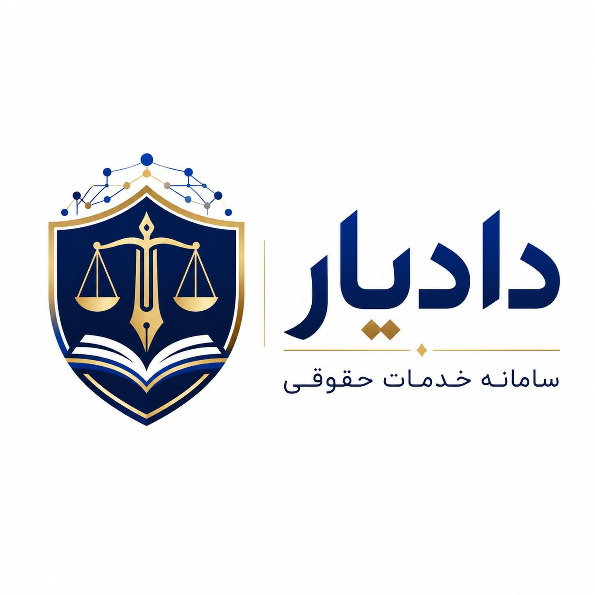

  

<h1 align="center">دادیار | DADYAR</h1>

  <strong>همراه کاردان شما در امور حقوقی</strong>

  نسل نوین خدمات هوشمند حقوقی و قضایی

---

# درباره دادیار

**دادیار (DADYAR)** بستری برای توسعه و ارائه خدمات نوین حقوقی و قضایی است که با بهره‌گیری از فناوری‌های روز، ابزارهای هوشمند و دانش حقوقی، در مسیر تسهیل دسترسی جامعه به اطلاعات، اسناد و خدمات حقوقی فعالیت می‌کند.

دادیار بر این باور است که بخش قابل توجهی از اختلافات و دعاوی حقوقی را می‌توان پیش از شکل‌گیری، از طریق افزایش آگاهی حقوقی، تنظیم صحیح روابط قراردادی، دسترسی به اسناد مناسب و ایجاد چهارچوب‌های روشن و قانونمند برای روابط اشخاص کاهش داد.

از این رو، فعالیت دادیار تنها معطوف به حل اختلاف پس از وقوع آن نیست؛ بلکه **پیشگیری حقوقی، ارتقای آگاهی عمومی، توسعه فرهنگ قانون‌مداری و فراهم‌ساختن ابزارهای حقوقی قابل دسترس برای جامعه** از ارکان اصلی رسالت آن به شمار می‌رود.

---

# رسالت دادیار

دادیار می‌کوشد با پیوند میان **دانش حقوق، فناوری و خدمات هوشمند**، دسترسی به خدمات و اطلاعات حقوقی را ساده‌تر، سریع‌تر و کارآمدتر سازد.

مهم‌ترین اهداف این مجموعه عبارت‌اند از:

- توسعه دسترسی عمومی به دانش و اطلاعات حقوقی؛
- کمک به پیشگیری از اختلافات و دعاوی از طریق افزایش آگاهی حقوقی؛
- ترویج فرهنگ تنظیم مکتوب و منظم روابط حقوقی و اقتصادی؛
- ارائه ابزارها و خدمات هوشمند برای تسهیل امور حقوقی و قضایی؛
- کمک به اشخاص در شناخت بهتر حقوق، تعهدات و آثار حقوقی تصمیمات خود؛
- فراهم‌کردن نمونه اسناد و قراردادهای حقوقی برای استفاده عمومی؛
- بهره‌گیری مسئولانه از فناوری‌های نوین در توسعه خدمات حقوقی؛
- پاسداری از سرمایه، زمان و حقوق اشخاص از طریق پیشگیری و آگاهی‌رسانی.

---

# خدمات دادیار

خدمات و ابزارهای دادیار حوزه‌های مختلف حقوقی و قضایی را در بر می‌گیرد و با هدف ایجاد بستری یکپارچه برای دسترسی به منابع و خدمات حقوقی توسعه یافته است.

از جمله حوزه‌های فعالیت دادیار می‌توان به موارد زیر اشاره کرد:

**تنظیم و ارائه اسناد و قراردادهای حقوقی**، دسترسی به نمونه قراردادهای داخلی و بین‌المللی، خدمات مرتبط با اسناد حقوقی، جست‌وجو و دسترسی به آرای قضایی، ابزارهای پژوهش و تحلیل حقوقی، خدمات مرتبط با دعاوی و امور قضایی، خدمات تخصصی حقوقی و بهره‌گیری از ابزارهای هوشمند در پردازش و دسترسی به اطلاعات حقوقی.

دادیار در توسعه این خدمات، اصل **دسترسی‌پذیری، شفافیت، قانون‌مداری و استفاده مسئولانه از فناوری** را مورد توجه قرار می‌دهد.

---

# مخزن رسمی قراردادهای دادیار

این مخزن، **مخزن عمومی و رسمی انتشار قراردادها و نمونه اسناد حقوقی تنظیم و تدوین‌شده برای مجموعه دادیار** است.

هدف از ایجاد این Repository، علاوه بر فراهم‌کردن دسترسی عمومی به نمونه قراردادهای حقوقی، ایجاد سابقه‌ای شفاف و قابل رهگیری از انتشار، توسعه و به‌روزرسانی این اسناد است.

هر سند می‌تواند دارای شناسه، نسخه و سابقه انتشار مستقل باشد و تغییرات اساسی آن از طریق تاریخچه این مخزن قابل پیگیری خواهد بود.

---

# چرا قراردادهای دادیار به‌صورت عمومی منتشر می‌شوند؟

بنیان بسیاری از روابط اجتماعی و فعالیت‌های اقتصادی بر **شناخت حقوق و تعهدات طرفین و ایجاد چهارچوبی روشن، منصفانه و قانونمند برای همکاری** استوار است.

قرارداد صحیح تنها وسیله‌ای برای اثبات توافق طرفین پس از وقوع اختلاف نیست؛ بلکه می‌تواند یکی از مؤثرترین ابزارهای پیشگیری از اختلاف باشد.

دادیار با همین رویکرد، بخشی از قراردادها و اسناد حقوقی خود را در دسترس عموم قرار می‌دهد تا اشخاص بتوانند با آگاهی بیشتر نسبت به تنظیم روابط حقوقی خود اقدام کنند.

انتشار عمومی این مجموعه در راستای رسالت دادیار برای **گسترش دانش حقوقی، پیشگیری از اختلافات، توسعه قانون‌مداری و تسهیل دسترسی عمومی به ابزارهای حقوقی** صورت می‌گیرد.

---

# حقوق پدیدآورنده و سابقه انتشار

این Repository همچنین به‌عنوان یکی از مراجع ثبت سابقه انتشار عمومی مجموعه قراردادهای دادیار نگهداری می‌شود.

تاریخچه Commitها، نسخه‌های منتشرشده، شناسه اسناد و سایر اطلاعات ثبت‌شده در مخزن، سابقه توسعه و انتشار اسناد را مستند می‌کنند.

هدف از اعلام حقوق پدیدآورنده، **محدودکردن استفاده متعارف عموم از نمونه قراردادها نیست**. این اسناد با هدف بهره‌مندی جامعه منتشر می‌شوند.

در عین حال، انتشار عمومی یک اثر به معنای صرف‌نظر از حقوق پدیدآورنده یا مجاز بودن انتساب اثر به شخص ثالث به‌عنوان پدیدآورنده اصلی نیست.

شرایط تفصیلی استفاده، بازنشر، اقتباس و انتساب آثار در فایل مستقل https://github.com/dadyar-legal-contracts/README.md این مخزن اعلام خواهد شد.

---

# استفاده از نمونه قراردادها

قراردادهای موجود در این مخزن، نمونه‌های عمومی هستند و ضرورتاً برای تمامی اشخاص، معاملات و شرایط حقوقی مناسب نیستند.

ماهیت و آثار هر قرارداد می‌تواند بر اساس موضوع، طرفین، شروط اختصاصی، قوانین لازم‌الاجرا، مقررات خاص، وضعیت اموال و سایر شرایط پرونده متفاوت باشد.

بنابراین کاربران باید پیش از استفاده نهایی از هر سند، تناسب مفاد آن را با شرایط خاص خود بررسی کرده و در موارد لازم از مشاوره تخصصی حقوقی استفاده کنند.

انتشار این اسناد به‌تنهایی به معنای ایجاد رابطه وکیل و موکل، قبول وکالت، ارائه نظر حقوقی اختصاصی یا تضمین نتیجه یک رابطه قراردادی یا قضایی نیست.

---

# ساختار اسناد

برای ایجاد نظام منظم انتشار، اسناد این مجموعه می‌توانند با شناسه اختصاصی دادیار منتشر شوند.

نمونه:

DADYAR-IR-[DOCUMENT-ID]_[PERSIAN TITLE].pdf

برای هر سند، حسب مورد، اطلاعاتی مانند عنوان قرارداد، شناسه سند، شماره نسخه، تاریخ انتشار و تاریخ آخرین بازنگری نگهداری خواهد شد.

---

# به‌روزرسانی مستمر

حقوق و مقررات همواره در معرض اصلاح، تغییر و تحول قرار دارند.

به همین دلیل، قراردادهای منتشرشده در این مجموعه ممکن است متناسب با تغییر قوانین و مقررات، نیازهای عملی جامعه و تجربیات حاصل از کاربرد آنها مورد بازنگری و تکمیل قرار گیرند.

نسخه‌های جدید، جایگزین سابقه نسخه‌های پیشین نخواهند شد و تاریخچه توسعه اسناد، تا حد امکان از طریق نظام Version Control این مخزن حفظ می‌شود.

---

# DADYAR

**دادیار — همراه کاردان شما در امور حقوقی**

نسل نوین خدمات هوشمند حقوقی و قضایی

آدرس وب سایت : https://dadyar.org

---

## English

### DADYAR Legal Contracts Repository

DADYAR is a legal technology platform focused on facilitating access to legal knowledge, documents, judicial resources, and intelligent legal services.

This repository serves as the official public repository for legal contract templates and documents prepared and published for DADYAR.

The repository has been established to provide public access to legal contract templates while maintaining a transparent and traceable record of their publication, development, revision, and version history.

DADYAR believes that legal awareness, properly structured agreements, and clear contractual relationships can play an important role in preventing disputes and protecting the rights and interests of individuals and businesses.

The publication of these documents forms part of DADYAR's broader mission to promote legal awareness, lawful social and economic relations, preventive legal practice, and responsible use of modern technology in the delivery of legal services.

Public availability of these documents does not, by itself, constitute a waiver of authorship or intellectual property rights.

Detailed terms concerning use, reproduction, adaptation, redistribution, and attribution will be provided separately in the repository's `LICENSE.md`.

---

Official Website: https://dadyar.org

Copyright © DADYAR , DESIGN BY H
All rights concerning authorship and original publication are reserved subject to the terms stated in this repository.
